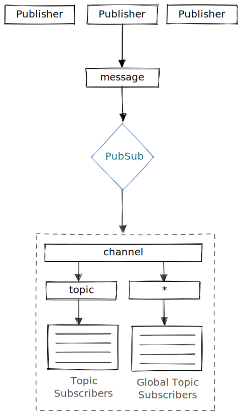

# **Process PubSub**

A tiny library that enables node applications to publish events to one multiple interested consumers asynchronously, without coupling the producers to the consumers.

> Works **only** on single process, to provide effective way to decouple producers from consumers 

[](https://nodejs.org)
[](https://www.npmjs.com/package/process-pubsub)
[](https://github.com/m-elbably/process-pubsub/workflows/process-pubsub/badge.svg)
[](https://coveralls.io/github/m-elbably/process-pubsub?branch=main)
[](https://raw.githubusercontent.com/m-elbably/process-pubsub/master/LICENSE)

### How Process PubSub works:
<p align="center">
  
</p>

## Installation
    npm install process-pubsub --save

## Features
- Simplicity & flexibility
- Light weight

## Usage
### Channels & Topics
- **Channel**: is a logical container used to send and receive messages, publishing/receiving messages should be through a channel
- **Topic**: is a logical container within channel used to send and receive messages, publishing/receiving messages should be through a topic registered within a channel

### Subscription
`subscribe` function can be used to subscribe to one or more channels and topics, through `Subscribtion` object:

Subscription:
- `channel` _String_ Channel name
- `topic` _String_ Topic name
- `once` _Boolean_, _optional_, default = `fasle` Get notified about specific event only once
- `callback` _Function(message, metadata)_ Callback function will be invoked when message published to a `channel` and/or `topic`

Simple subscription:
```typescript
import {PubSub} from 'process-pubsub';

const pubsub = new PubSub();
pubsub.subscribe({
    channel: 'orders',
    topic: 'created',
    callback: (message, metadata) => {
        console.log(message);
    }
});
```
Subscription to get notified for all messages in specific channel is also possible using `*` with `topic` field:
```typescript
import {PubSub} from 'process-pubsub';

const pubsub = new PubSub();
pubsub.subscribe({
    channel: 'orders',
    topic: '*',
    callback: (message, metadata) => {
        console.log(message);
    }
});
```
> Subscribe to all messages published to any `topic` under `channel` "orders", so `callback` handler will be call if we publish messages to "create", "updated" topic for example or any other topic under "orders" channel  

**Once subscription**

Setting `once` field to `true` will notify the subscriber with the event for only one-time, after that the subscription will be removed.
```typescript
import {PubSub} from 'process-pubsub';

const pubsub = new PubSub();
pubsub.subscribe({
    channel: 'orders',
    topic: 'created',
    once: true,
    callback: (message, metadata) => {
        console.log(message);
    }
});
```

#### Message metadata
`callback` function will also receive `metadata` object with message, which includes the following fields:
- `channel` The current message destination channel 
- `topic` The current message destination topic (_If subscriber is listening to all topic using `*` under specific channel, metadata will be very useful_)

### Publishing
We can publish directly to specific **channel** and **topic**:

```typescript
import {PubSub} from 'process-pubsub';
const pubsub = new PubSub();
pubsub.publish('orders', 'created', {id: 1, amount: 120});
```
> - This message will be received by all subscribers of **channel** `orders` and **topic** `created`
> - This message will be received also by subscribers of **channel** `orders` and **topic** `*`

We can publish to all topics registered within a specific **channel**, by using `*` for **topic**

```typescript
import {PubSub} from 'process-pubsub';
const pubsub = new PubSub();
pubsub.publish('orders', '*', {id: 1, amount: 120});
```
> This message will be received by all subscribers of **channel** `orders`, whatever the **topic** the subscriber is registered with 

#### Synchronous Request-Reply
Synchronous Request-Reply style is also possible using `publishAndGetReply` function, we can publish message and wait for response from first register subscriber, or break the operation if timeout exceeded.

```typescript
import {PubSub} from 'process-pubsub';

const pubsub = new PubSub();
const response = await pubsub.publishAndGetReply('orders', 'created', {id: 1, amount: 120});
```

#### License
MIT

